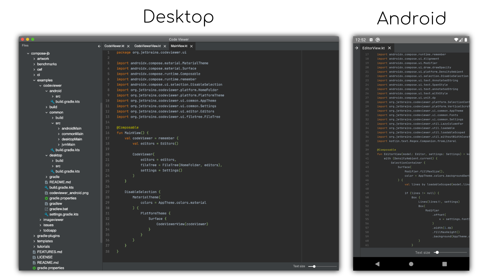

MPP Code Viewer example for desktop/android written in Multiplatform Compose library.

Original Repo URL: https://github.com/JetBrains/compose-jb/tree/master/examples/codeviewer

This cloned version have an additional functionality where you can filter the file content with keywords.

I mainly added this enhancement for my specific use case to filter log files.

### Running desktop application
```
./gradlew :desktop:run
```

### Building native desktop distribution
```
./gradlew :desktop:package
# outputs are written to desktop/build/compose/binaries
```

### Installing Android application on device/emulator
```
./gradlew installDebug
```

